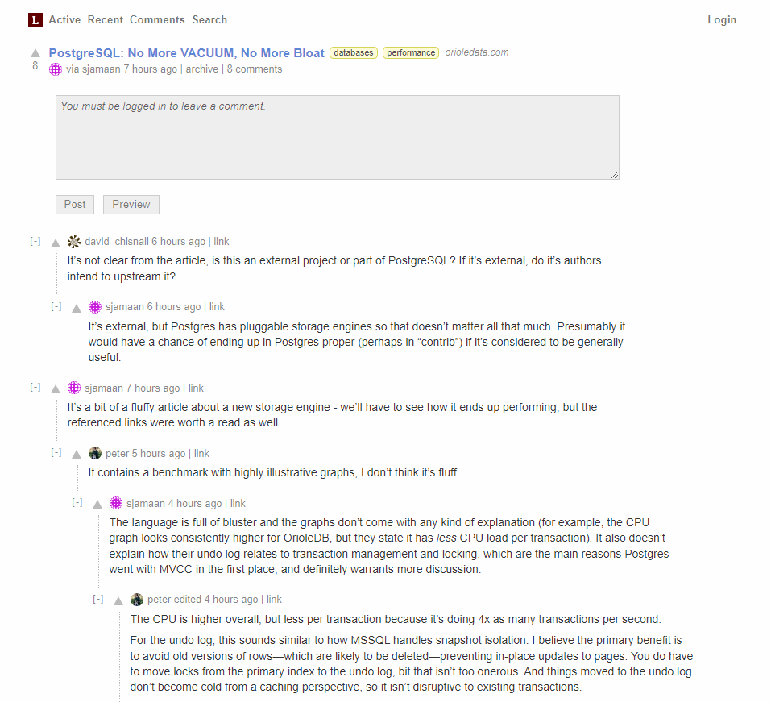

# Lobster CI/CD pipeline

Deploy Lobster with CI/CD on Elestio

 
 

# Once deployed ...

You can open Lemmy UI here:

    URL: https://[CI_CD_DOMAIN]
    login: admin
    password: [ADMIN_PASSWORD]
